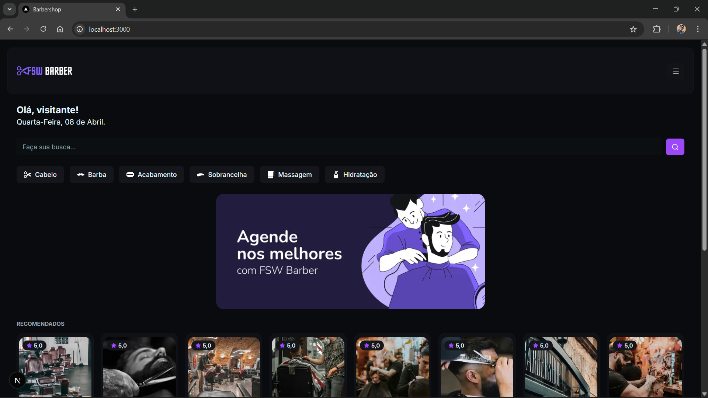
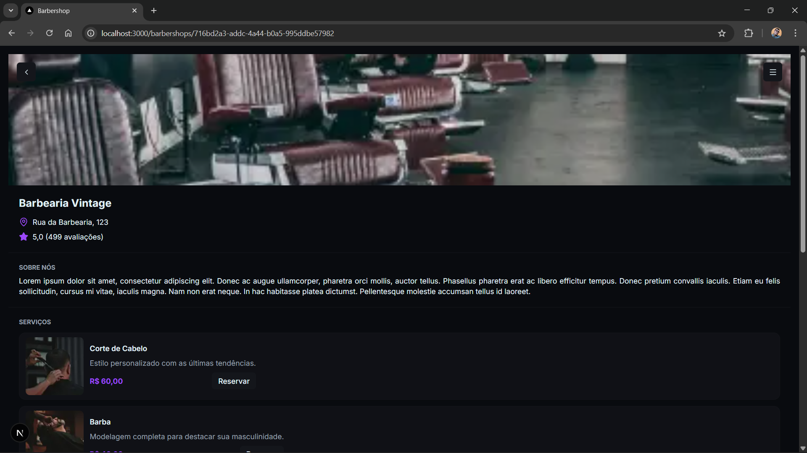
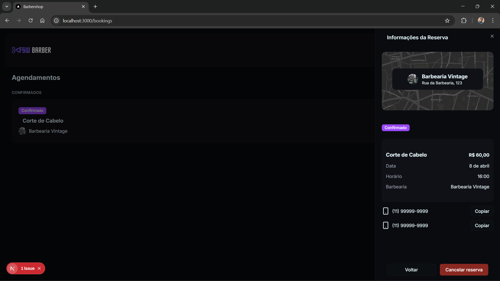
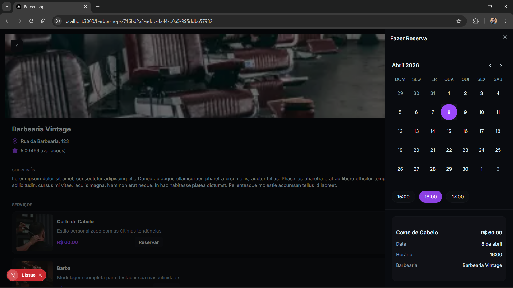
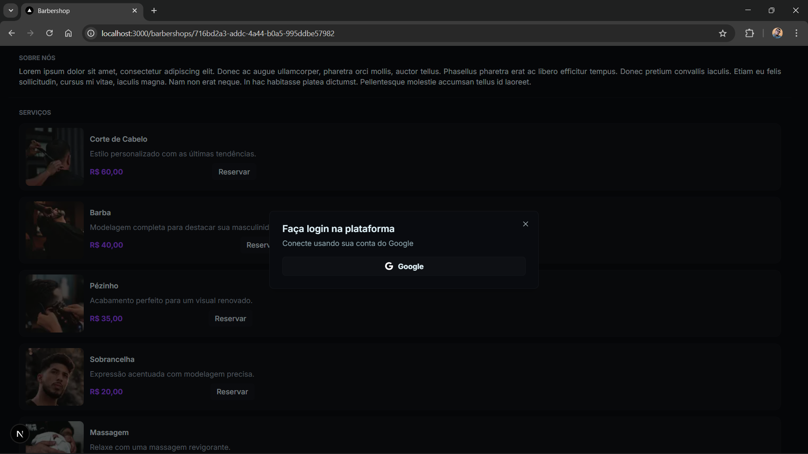

<h1 align="center"> 💈 Barbershop </h1>

<p align="center">
Uma plataforma moderna de agendamento online para barbearias, desenvolvida para simplificar a conexão entre clientes e profissionais.
</p>

<p align="center">
  <a href="#-tecnologias">Tecnologias</a>&nbsp;&nbsp;&nbsp;|&nbsp;&nbsp;&nbsp;
  <a href="#-projeto">Projeto</a>&nbsp;&nbsp;&nbsp;|&nbsp;&nbsp;&nbsp;
  <a href="#-funcionalidades">Funcionalidades</a>&nbsp;&nbsp;&nbsp;|&nbsp;&nbsp;&nbsp;
  <a href="#-configuracao">Configuração</a>
</p>

<br>

## 💻 Projeto

O **Barbershop** é uma aplicação Full Stack que permite aos usuários encontrar barbearias próximas, visualizar serviços oferecidos e realizar agendamentos de forma rápida e intuitiva. O projeto conta com um sistema de autenticação robusto e uma interface responsiva focada na experiência do usuário.

## ✨ Funcionalidades

- **Busca de Barbearias**: Pesquisa por nome ou categoria de serviço.
- **Visualização de Detalhes**: Informações completas sobre cada barbearia, incluindo endereço, serviços e contatos.
- **Sistema de Agendamento**: Escolha de serviço, data e horário com validação de disponibilidade.
- **Autenticação Social**: Login simplificado utilizando Google via NextAuth.
- **Gestão de Agendamentos**: Visualização de agendamentos confirmados e histórico.
- **Dashboard Administrativo**: Área dedicada para gestão de clientes e serviços (em desenvolvimento).

## 📸 Layout

Aqui estão algumas capturas de tela da versão mobile do projeto, que é o foco principal da experiência do usuário:

<p align="center">
  
  
  
  
  
</p>

## 🚀 Tecnologias

Este projeto foi construído com as tecnologias mais modernas do ecossistema JavaScript:

- **Framework**: [Next.js 15](https://nextjs.org/) (App Router)
- **Linguagem**: [TypeScript](https://www.typescriptlang.org/)
- **Estilização**: [Tailwind CSS 4](https://tailwindcss.com/)
- **ORM**: [Prisma](https://www.prisma.io/)
- **Banco de Dados**: [PostgreSQL](https://www.postgresql.org/)
- **Autenticação**: [NextAuth.js](https://next-auth.js.org/)
- **Componentes UI**: [Radix UI](https://www.radix-ui.com/) & [Lucide React](https://lucide.dev/)
- **Validação**: [Zod](https://zod.dev/)
- **Padronização**: [Biome](https://biomejs.dev/)

## ⚙️ Configuração Local

### Pré-requisitos
- Node.js (v20 ou superior)
- Docker e Docker Compose (para o banco de dados)

### Passo a passo

1. **Clonar o repositório**
   ```bash
   git clone https://github.com/seu-usuario/barbershop.git
   cd barbershop
   ```

2. **Instalar dependências**
   ```bash
   npm install
   ```

3. **Configurar variáveis de ambiente**
   Crie um arquivo `.env` baseado no `.env.example`:
   ```bash
   cp .env.example .env
   ```
   Preencha as credenciais do Google Cloud Console e a `DATABASE_URL`.

4. **Subir o banco de dados (Docker)**
   ```bash
   docker-compose up -d
   ```

5. **Preparar o banco de dados**
   Gere o client do Prisma e execute as migrações:
   ```bash
   npx prisma generate
   npx prisma db push
   ```

6. **Popular o banco (Seed)**
   ```bash
   npx prisma db seed
   ```

7. **Executar em modo de desenvolvimento**
   ```bash
   npm run dev
   ```
   Acesse `http://localhost:3000` no seu navegador.

---
<p align="center">Desenvolvido com ❤️ por <strong>Lurram Santos</strong></p>
